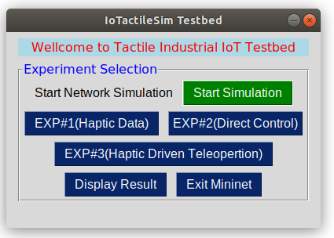
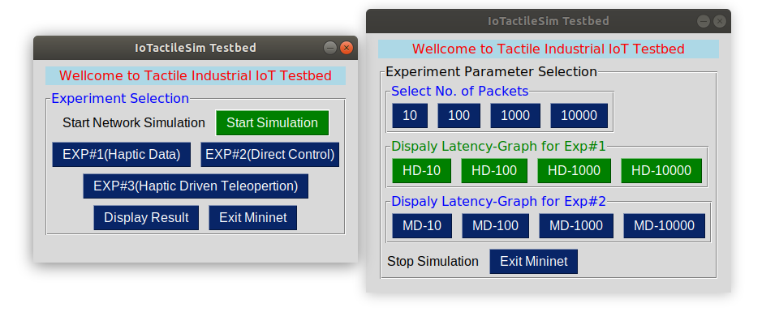

# IoTactileSim: A Virtual Testbed for Tactile Industrial Internet of Things Services  
A virtual Tesebed Framework for Tactile Industrial IoTs to investiage the QoS and QoE requirments and test their proposed Algorithms.
## Package and OS Requirments 
* Ubuntu 18.04 LTS
* Python v3.8
* Mininet Emulator 3.6.9
* CoppeliaSim 4.2
* Other packeges 
(pynput==1.1.7; ;pandas; Sim_GUI; socklet; pickle; multiprocessing;  libgl1-mesa-dev; mss==3.1.2; numpy; matplotlib)

## Starting ***IoTactileSim***
*To run the IoTactileSim, go to the folder [Mininet_Emulator](Mininet_Emulator) and run the command $sudo python3 [MininetEmulator.py](Mininet_Emulator/MininetEmulator.py)
* GUI window will poop up to selecte start simulation tap *(After pressing  start simulation buttion it create netrwork topology and asked for Experiment Type)* 
1. Exp#1; Haptic Data Transfer
2. Exp#2 Direct Control
3. Exp#3 Mouse Control with Feedback
4. Exit Mininet
* After select desir Experment number it leads towards packet selection module 
* Select packet number it start the simmulation and store the results into selected Experment latencyfile folder [HD_Latencyfiles](1_Exp_Haptic_Data/HD_latencyfiles/), [MD_Latencyfiles](2_Exp_Mouse_VREP_Feedback/MD_latencyfiles/)
* After finish experiments its open a new window to display results and store in to [HD_graphs](1_Exp_Haptic_Data/HD_graphs/), [MD_graphs](2_Exp_Mouse_VREP_Feedback/MD_graphs/)
* Finaly, ***IoTactileSim*** asked to proceed with new experiment or end simulation.

###Note
The experiment results represent in the paper are stored in [Experiment Results Files](/Experiment Results Files/)

